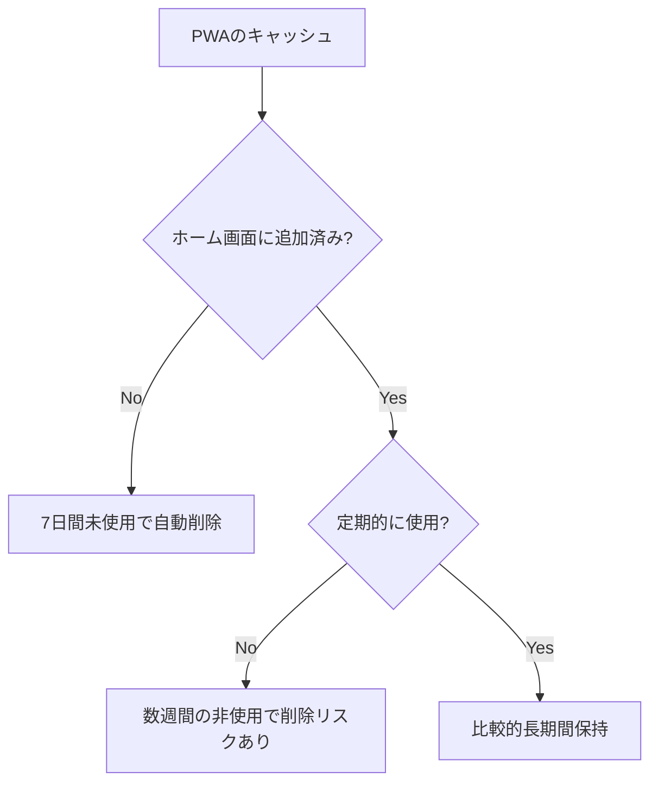
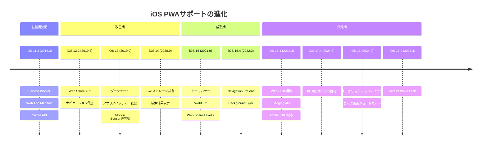

# iOS PWA（Progressive Web App）仕様 完全ガイド

> [!NOTE]
> 本資料は2026年3月時点の情報に基づいています。iOS/Safariの仕様は各バージョンで変更される可能性があります。

---

## 目次

1. [概要と歴史的経緯](#1-概要と歴史的経緯)
2. [Web App Manifest 対応状況](#2-web-app-manifest-対応状況)
3. [ディスプレイモード](#3-ディスプレイモード)
4. [Service Worker](#4-service-worker)
5. [ストレージとキャッシュ](#5-ストレージとキャッシュ)
6. [Push通知（Web Push）](#6-push通知web-push)
7. [Apple独自メタタグ](#7-apple独自メタタグ)
8. [アイコンとスプラッシュスクリーン](#8-アイコンとスプラッシュスクリーン)
9. [対応Web API一覧](#9-対応web-api一覧)
10. [制限事項と非対応機能](#10-制限事項と非対応機能)
11. [iOS vs Android 比較表](#11-ios-vs-android-比較表)
12. [EU DMA（デジタル市場法）の影響](#12-eu-dmaデジタル市場法の影響)
13. [iOSバージョン別サポート履歴](#13-iosバージョン別サポート履歴)
14. [開発ベストプラクティス](#14-開発ベストプラクティス)
15. [今後の展望](#15-今後の展望)

---

## 1. 概要と歴史的経緯

### PWAとは
Progressive Web App（PWA）は、Webテクノロジー（HTML/CSS/JavaScript）で構築され、ネイティブアプリに近い体験を提供するWebアプリケーション。Service Worker、Web App Manifest、HTTPS を基盤技術とする。

### Appleの歴史的スタンス

| 年 | 出来事 |
|------|--------|
| **2007** | Steve Jobsが初代iPhoneのサードパーティアプリ基盤としてWebアプリを提唱 |
| **2008** | App Store登場によりネイティブアプリへ路線変更 |
| **2018 (iOS 11.3)** | Service WorkerとWeb App Manifestを正式サポート開始 |
| **2019 (iOS 12.2)** | ナビゲーションジェスチャー、Web Share API対応 |
| **2019 (iOS 13)** | アプリライフサイクル改善、ダークモード対応 |
| **2020 (iOS 14)** | Safari-PWA間のService Workerストレージ共有 |
| **2021 (iOS 15)** | テーマカラー対応、WebGL2対応 |
| **2023 (iOS 16.4)** | **Web Push通知対応**（ホーム画面追加済みPWA限定） |
| **2024 (iOS 17.4)** | EU向けDMA対応（サードパーティブラウザエンジン許可） |
| **2024 (iOS 18)** | サードパーティブラウザによるWeb App作成対応、ダーク/ティンテッドアイコン |
| **2025 (Safari 18.4)** | Screen Wake Lock対応 |

> [!IMPORTANT]
> AppleはPWAを「Home Screen web apps」と呼称しており、PWAという用語を公式には使っていません。

---

## 2. Web App Manifest 対応状況

Web App Manifest（`manifest.json` / `manifest.webmanifest`）は、PWAのメタデータを定義するJSONファイルです。

### 対応プロパティ

| プロパティ | 対応状況 | 対応バージョン | 備考 |
|-----------|---------|-------------|------|
| `name` | ✅ 対応 | iOS 11.3+ | アプリ名 |
| `short_name` | ✅ 対応 | iOS 11.3+ | ホーム画面表示名 |
| `start_url` | ✅ 対応 | iOS 11.3+ | 起動URL |
| `display` | ✅ 部分対応 | iOS 11.3+ | `standalone` のみ完全対応 |
| `scope` | ✅ 対応 | iOS 11.3+ | アプリのスコープ |
| `icons` | ✅ 対応 | iOS 11.3+ | `apple-touch-icon` が優先される場合あり |
| `theme_color` | ✅ 対応 | iOS 15.0+ | ステータスバーの色 |
| `id` | ✅ 対応 | iOS 16.4+ | アプリの一意識別子 |
| `background_color` | ❌ 非対応 | — | スプラッシュスクリーンに反映されない |
| `orientation` | ❌ 非対応 | — | 画面方向のロック不可 |
| `shortcuts` | ❌ 非対応 | — | ホーム画面ショートカット |
| `description` | ❌ 非対応 | — | — |
| `categories` | ❌ 非対応 | — | — |
| `screenshots` | ❌ 非対応 | — | インストールUIでのスクリーンショット表示不可 |
| `related_applications` | ❌ 非対応 | — | — |
| `prefer_related_applications` | ❌ 非対応 | — | — |

### 基本的なManifest例

```json
{
  "name": "My Awesome App",
  "short_name": "MyApp",
  "start_url": "/",
  "display": "standalone",
  "scope": "/",
  "theme_color": "#000000",
  "icons": [
    {
      "src": "/icons/icon-192x192.png",
      "sizes": "192x192",
      "type": "image/png"
    },
    {
      "src": "/icons/icon-512x512.png",
      "sizes": "512x512",
      "type": "image/png"
    }
  ]
}
```

### HTMLでの読み込み

```html
<link rel="manifest" href="/manifest.json">
```

---

## 3. ディスプレイモード

| モード | iOS対応 | 動作 |
|--------|---------|------|
| `standalone` | ✅ 完全対応 | ブラウザUI非表示。ネイティブアプリ風の体験 |
| `fullscreen` | ⚠️ フォールバック | `standalone` にフォールバック |
| `minimal-ui` | ❌ 非対応 | `browser` にフォールバック |
| `browser` | ✅ 対応 | 通常のブラウザタブとして表示 |

### standaloneモードの検出

```javascript
// iOS固有の検出方法
if (window.navigator.standalone === true) {
  console.log('iOS PWAのスタンドアロンモードで動作中');
}

// 標準的な検出方法（iOS Safari 13+）
if (window.matchMedia('(display-mode: standalone)').matches) {
  console.log('スタンドアロンモードで動作中');
}
```

> [!WARNING]
> `window.navigator.standalone` はApple独自のプロパティです。標準仕様の `display-mode` メディアクエリと併用することを推奨します。

---

## 4. Service Worker

### 対応状況（iOS 11.3+）

Service Workerは、バックグラウンドで動作するJavaScriptプロセスで、オフライン機能やキャッシュ管理を担います。

| 機能 | 対応 | 備考 |
|------|------|------|
| `fetch` イベント | ✅ | ネットワークリクエストのインターセプト |
| `install` / `activate` イベント | ✅ | ライフサイクルイベント |
| Cache API | ✅ | 50MB制限あり |
| `importScripts()` | ✅ | — |
| Navigation Preload | ✅ | iOS 15.4+ |
| Background Sync | ⚠️ 部分対応 | iOS 15.4+。信頼性はネイティブに劣る |
| Periodic Background Sync | ❌ | — |
| Background Fetch | ❌ | — |
| Push API | ✅ | iOS 16.4+。ホーム画面追加必須 |

### 重要な制限

- **非アクティブ時のデータ削除**: ホーム画面に追加していないWebアプリは、**7日間未使用**でService Workerのキャッシュやデータが自動削除される
- **ホーム画面のPWA**: より長期間データが保持されるが、数週間使用しないとキャッシュが削除される可能性がある
- **Safari-PWA間のストレージ隔離**: Safari内とホーム画面のPWAでは、多くのストレージが**分離されている**（Cache Storageのみ共有可能）

### Service Workerの基本実装例

```javascript
// sw.js
const CACHE_NAME = 'my-app-v1';
const CACHE_URLS = [
  '/',
  '/index.html',
  '/styles.css',
  '/app.js'
];

// インストール時にキャッシュ
self.addEventListener('install', (event) => {
  event.waitUntil(
    caches.open(CACHE_NAME)
      .then((cache) => cache.addAll(CACHE_URLS))
  );
});

// フェッチ時のキャッシュ戦略
self.addEventListener('fetch', (event) => {
  event.respondWith(
    caches.match(event.request)
      .then((response) => response || fetch(event.request))
  );
});
```

---

## 5. ストレージとキャッシュ

### ストレージ種別と制限

| ストレージ種別 | 容量上限 | 備考 |
|-------------|---------|------|
| **Cache Storage (Service Worker)** | **50MB** | パーティションごと。メディアリッチなアプリには厳しい |
| **IndexedDB** | **500MB〜数GB** | デバイスの空き容量に依存。大容量データに推奨 |
| **localStorage** | **5MB** | 同期的。少量のデータ向け |
| **sessionStorage** | **5MB** | セッション単位。タブを閉じると消える |
| **Web SQL** | 非推奨 | Safari 13以降は新規作成不可 |

### キャッシュ削除ポリシー



> [!CAUTION]
> iOSではストレージの永続化保証がありません。`navigator.storage.persist()` はSafariで呼び出し可能ですが、実際の永続化は保証されません。重要なデータはサーバーに同期することを強く推奨します。

---

## 6. Push通知（Web Push）

### 前提条件

Web Push通知を利用するには、以下の**すべて**の条件を満たす必要があります：

1. **iOS 16.4以上**
2. **PWAがホーム画面に追加されていること**
3. **`manifest.json` の `display` が `standalone` または `fullscreen`**
4. **HTTPS配信**
5. **Service Workerが登録されていること**
6. **ユーザーのボタンタップ等、直接的な操作で許可を求めること**

### 通知の表示箇所

- ✅ ロック画面
- ✅ 通知センター
- ✅ Apple Watch（ペアリング済みの場合）
- ✅ バナー通知

### 対応API

| API | 対応 | 備考 |
|-----|------|------|
| `Notification.requestPermission()` | ✅ | ユーザー操作が必要 |
| `PushManager.subscribe()` | ✅ | — |
| `ServiceWorkerRegistration.showNotification()` | ✅ | — |
| `push` イベント（Service Worker内） | ✅ | — |
| `notificationclick` イベント | ✅ | — |
| Silent Push（サイレント通知） | ❌ | — |
| `Notification.badge` | ⚠️ | 通知許可が必要 |

### Push通知の実装例

```javascript
// 1. 通知許可の要求（ボタンクリックハンドラ内で呼ぶこと）
async function requestNotificationPermission() {
  const permission = await Notification.requestPermission();
  if (permission === 'granted') {
    await subscribeToPush();
  }
}

// 2. Push購読
async function subscribeToPush() {
  const registration = await navigator.serviceWorker.ready;
  const subscription = await registration.pushManager.subscribe({
    userVisibleOnly: true,
    applicationServerKey: urlBase64ToUint8Array(VAPID_PUBLIC_KEY)
  });
  // サーバーにsubscription情報を送信
  await sendSubscriptionToServer(subscription);
}

// sw.js内
self.addEventListener('push', (event) => {
  const data = event.data?.json() ?? {};
  event.waitUntil(
    self.registration.showNotification(data.title, {
      body: data.body,
      icon: '/icons/icon-192x192.png',
      badge: '/icons/badge-72x72.png'
    })
  );
});

self.addEventListener('notificationclick', (event) => {
  event.notification.close();
  event.waitUntil(
    clients.openWindow(event.notification.data?.url ?? '/')
  );
});
```

> [!IMPORTANT]
> `Notification.requestPermission()` はユーザーの直接操作（ボタンタップ等）の中で呼ばれなければなりません。ページ読み込み時に自動的に呼ぶと**無視されます**。

---

## 7. Apple独自メタタグ

iOSのPWAでは、標準のWeb App Manifestに加えて、以下のApple固有の `<meta>` タグを使用します。

### 必須・推奨メタタグ

```html
<!-- PWAとして動作（スタンドアロンモード有効化） -->
<meta name="apple-mobile-web-app-capable" content="yes">

<!-- ホーム画面に表示するアプリ名 -->
<meta name="apple-mobile-web-app-title" content="My App">

<!-- ステータスバーのスタイル -->
<meta name="apple-mobile-web-app-status-bar-style" content="default">

<!-- テーマカラー（iOS 15+） -->
<meta name="theme-color" content="#000000">

<!-- ビューポート設定 -->
<meta name="viewport" content="width=device-width, initial-scale=1, viewport-fit=cover">
```

### ステータスバースタイル

| 値 | 説明 |
|----|------|
| `default` | 白背景 + 黒文字 |
| `black` | 黒背景 + 白文字 |
| `black-translucent` | 半透明。コンテンツがステータスバー下まで拡張 |

```css
/* black-translucent使用時に安全領域を確保 */
body {
  padding-top: env(safe-area-inset-top);
  padding-bottom: env(safe-area-inset-bottom);
  padding-left: env(safe-area-inset-left);
  padding-right: env(safe-area-inset-right);
}
```

> [!NOTE]
> `apple-mobile-web-app-capable` は Web App Manifest を正しく設定すれば不要との意見もあります（web.dev）。ただし後方互換性のために両方設定することを推奨します。

---

## 8. アイコンとスプラッシュスクリーン

### アイコン設定

```html
<!-- Apple Touch Icon（推奨サイズ: 180x180） -->
<link rel="apple-touch-icon" href="/icons/apple-touch-icon.png">

<!-- 複数サイズ対応 -->
<link rel="apple-touch-icon" sizes="152x152" href="/icons/icon-152x152.png">
<link rel="apple-touch-icon" sizes="167x167" href="/icons/icon-167x167.png">
<link rel="apple-touch-icon" sizes="180x180" href="/icons/icon-180x180.png">
```

#### アイコンのルール

- **透過は避ける**: 透過PNGはiOSで黒背景になるため、必ず不透明な背景を使用
- **角丸は自動適用**: iOSが自動的に角丸マスクを適用するため、素材は正方形で作成
- **`apple-touch-icon` が manifest の `icons` より優先される**（両方定義した場合）
- iOS 15.4以降は、`apple-touch-icon` 未定義時にmanifestのアイコンを使用

### スプラッシュスクリーン（起動画面）

> [!WARNING]
> iOSはWeb App Manifestの `background_color` をスプラッシュスクリーンに使用しません。`apple-touch-startup-image` による個別画像の指定が必要です。

```html
<!-- iPhone 15 Pro Max / 16 Plus (430x932 @3x) -->
<link rel="apple-touch-startup-image"
      href="/splash/splash-1290x2796.png"
      media="(device-width: 430px) and (device-height: 932px) and (-webkit-device-pixel-ratio: 3) and (orientation: portrait)">

<!-- iPhone 15 / 14 Pro (393x852 @3x) -->
<link rel="apple-touch-startup-image"
      href="/splash/splash-1179x2556.png"
      media="(device-width: 393px) and (device-height: 852px) and (-webkit-device-pixel-ratio: 3) and (orientation: portrait)">

<!-- ... 各デバイスサイズ分を定義 -->
```

- デバイスごとにポートレート・ランドスケープの2種類が必要
- 全デバイス対応には**20〜30枚以上**の画像が必要
- ツール（[pwa-asset-generator](https://github.com/nicedoc/pwa-asset-generator) 等）の利用を推奨

---

## 9. 対応Web API一覧

### ✅ 対応済みAPI

| API | 対応バージョン | 備考 |
|-----|-------------|------|
| **Service Worker** | iOS 11.3+ | PWAの基盤技術 |
| **Cache API** | iOS 11.3+ | 50MB制限 |
| **Fetch API** | iOS 10.3+ | — |
| **IndexedDB** | iOS 8+ | 最大500MB〜数GB |
| **Web Push API** | iOS 16.4+ | ホーム画面追加必須 |
| **Notifications API** | iOS 16.4+ | ホーム画面追加必須 |
| **Badging API** | iOS 16.4+ | ホーム画面追加+通知許可必須 |
| **Screen Wake Lock** | iOS 18.4+ | 画面スリープ防止 |
| **Geolocation API** | 初期から | ユーザー許可必要 |
| **Web Share API** | iOS 12.2+ | `navigator.share()` |
| **Web Share API Level 2** | iOS 15+ | ファイル共有対応 |
| **Payment Request API** | iOS 11.3+ | Apple Pay連携 |
| **WebAuthn / FIDO2** | iOS 13.3+ | パスワードレス認証 |
| **Intersection Observer** | iOS 12.2+ | — |
| **Resize Observer** | iOS 13.4+ | — |
| **Web Animations API** | iOS 13.4+ | — |
| **WebAssembly** | iOS 11+ | 高パフォーマンス計算 |
| **WebGL / WebGL2** | iOS 8+ / 15+ | 3Dグラフィックス |
| **Media Session API** | iOS 15+ | オーディオコントロール |
| **Web Speech API** | iOS 14.5+ | 音声認識・合成 |
| **Motion Sensor API** | iOS 13+ | 許可リクエスト必要 |
| **Pointer Events** | iOS 13+ | — |
| **CSS env()** | iOS 11.2+ | Safe Area対応 |

### ❌ 非対応API

| API | 備考 |
|-----|------|
| **Web Bluetooth** | Safariでは未対応 |
| **WebUSB** | Safariでは未対応 |
| **Web Serial** | Safariでは未対応 |
| **Web MIDI** | Safariでは未対応 |
| **Web NFC** | Safariでは未対応 |
| **Battery Status API** | プライバシー上の理由で未対応 |
| **Ambient Light Sensor** | 未対応 |
| **Periodic Background Sync** | 未対応 |
| **Background Fetch** | 未対応 |
| **File System Access API** | 未対応（部分的サポートのみ） |
| **Screen Orientation API** | ロック機能未対応 |
| **Idle Detection API** | 未対応 |
| **Contact Picker API** | 未対応 |
| **EyeDropper API** | 未対応 |

---

## 10. 制限事項と非対応機能

### インストール関連

- **自動インストールプロンプトがない**: Androidの `beforeinstallprompt` イベントに相当するものがない
- **手動インストールのみ**: ユーザーがSafariの共有メニュー → 「ホーム画面に追加」を手動で行う必要がある
- **App Storeに登録不可**: PWAはApp Storeで配信できない
- **App Libraryに表示されない**: iOS 14+のApp Libraryで適切にカテゴライズされない

### 実行環境の制限

- **WebKitエンジン強制**: iOS上のすべてのブラウザ（Chrome, Firefox等）はWebKitを使用する義務がある（EU圏外）
- **バックグラウンド実行の制限**: PWAがバックグラウンドに移行すると短時間で一時停止される
- **マルチタスク制限**: Split ViewやSlide Overに対応しない
- **Picture-in-Picture**: PWAからの利用は制限的
- **Siri連携不可**: ショートカットやSiri機能と連携できない
- **ウィジェット非対応**: ホーム画面ウィジェットを作成できない
- **ユニバーサルリンク非対応**: PWAをデフォルトのリンクハンドラに指定できない

### メディア関連

- **オートプレイ制限**: 動画・音声の自動再生はユーザー操作後のみ可能
- **フルスクリーンVideo**: `<video>` 要素のインラインプレイバックにはplaysinline属性が必要

### その他注意点

- **Face ID / Touch ID**: WebAuthn経由で利用可能だが、ネイティブアプリほどの統合性はない
- **ARKit**: Web上からはアクセス不可
- **Apple Vision Pro**: 「ホーム画面に追加」オプションがなく、PWA非サポート

---

## 11. iOS vs Android 比較表

| 機能 | iOS (Safari) | Android (Chrome) |
|------|:---:|:---:|
| **インストールプロンプト** | ❌ 手動のみ | ✅ 自動プロンプト |
| **App Store配信** | ❌ | ✅ (Google Play / TWA) |
| **Service Worker** | ✅ | ✅ |
| **Push通知** | ⚠️ 条件付き (16.4+) | ✅ |
| **サイレント通知** | ❌ | ✅ |
| **バッジング** | ⚠️ 条件付き | ✅ |
| **バックグラウンド同期** | ⚠️ 制限あり | ✅ |
| **定期バックグラウンド同期** | ❌ | ✅ |
| **Cache Storage上限** | 50MB | 動的（容量に依存） |
| **画面方向ロック** | ❌ | ✅ |
| **Web Bluetooth** | ❌ | ✅ |
| **Web NFC** | ❌ | ✅ |
| **Web USB** | ❌ | ✅ |
| **Web MIDI** | ❌ | ✅ |
| **File System Access** | ❌ | ✅ |
| **ショートカット (manifest)** | ❌ | ✅ |
| **スプラッシュスクリーン** | ⚠️ 手動画像 | ✅ manifest自動生成 |
| **ブラウザエンジン選択** | ❌ WebKit強制 | ✅ 任意 |
| **Screen Wake Lock** | ✅ (18.4+) | ✅ |
| **Payment Request** | ✅ | ✅ |
| **WebAuthn** | ✅ | ✅ |
| **Geolocation** | ✅ | ✅ |
| **ダークモード** | ✅ (iOS 13+) | ✅ |
| **ストレージ永続化** | ⚠️ 非保証 | ✅ |

---

## 12. EU DMA（デジタル市場法）の影響

### 経緯

1. **2024年2月**: Apple、iOS 17.4のEU向けベータでPWAスタンドアロンモードの削除を発表
2. **2024年3月**: 強い批判を受け、Apple決定を撤回。EU内でもフルPWAサポートを維持
3. **2024年 iOS 17.4正式リリース**: EU圏内でサードパーティブラウザエンジンを許可（`BrowserEngineKit`）
4. **2024年 iOS 18.2**: EU圏内でサードパーティブラウザエンジンの利用拡大

### 現状（2025-2026年）

- EU圏内ではサードパーティブラウザが独自エンジンで動作可能
- ただし`BrowserEngineKit`の採用はまだ限定的
- PWAのホーム画面追加機能はEU圏内でも引き続き利用可能
- 欧州委員会はAppleのDMA準拠状況を継続的に監視中

> [!NOTE]
> EU圏外（日本を含む）では従来通り、すべてのブラウザがWebKitエンジンの使用を義務付けられています。

---

## 13. iOSバージョン別サポート履歴



---

## 14. 開発ベストプラクティス

### 1. 必須チェックリスト

- [ ] **HTTPS**で配信しているか
- [ ] 有効な `manifest.json` を設置し、`<link rel="manifest">` で参照しているか
- [ ] `display: "standalone"` を設定しているか
- [ ] 192x192 と 512x512 のアイコンを用意しているか
- [ ] `apple-touch-icon`（180x180）を設定しているか
- [ ] Service Workerを登録し、オフラインフォールバックを用意しているか
- [ ] `<meta name="apple-mobile-web-app-capable" content="yes">` を含めているか
- [ ] `viewport` メタタグに `viewport-fit=cover` を設定しているか

### 2. ストレージ戦略

```javascript
// IndexedDBを主要ストレージとして使用（50MB制限を回避）
// Cache APIは静的アセットのキャッシュに限定

// キャッシュ削除に備えたリカバリー機構
self.addEventListener('activate', (event) => {
  // 古いキャッシュの削除
  event.waitUntil(
    caches.keys().then((keyList) =>
      Promise.all(keyList.map((key) => {
        if (key !== CACHE_NAME) return caches.delete(key);
      }))
    )
  );
});
```

### 3. インストール促進UI

自動プロンプトがないため、カスタムUIでユーザーにインストール手順を表示する：

```javascript
// iOS Safariの検出
const isIOS = /iphone|ipad|ipod/.test(
  window.navigator.userAgent.toLowerCase()
);
const isInStandaloneMode = window.navigator.standalone === true;

if (isIOS && !isInStandaloneMode) {
  // インストール案内バナーを表示
  showInstallBanner();
}
```

### 4. Safe Area対応

```css
/* ノッチ/Dynamic Island対応 */
html {
  /* 安全領域の環境変数を使用 */
  padding: env(safe-area-inset-top)
           env(safe-area-inset-right)
           env(safe-area-inset-bottom)
           env(safe-area-inset-left);
}

/* ステータスバーの背景色 */
body::before {
  content: '';
  position: fixed;
  top: 0;
  left: 0;
  right: 0;
  height: env(safe-area-inset-top);
  background: var(--theme-color);
  z-index: 9999;
}
```

### 5. ナビゲーション設計

```javascript
// iOSでは物理的な「戻る」ボタンがないため、
// エッジスワイプジェスチャーとの競合に注意
// アプリ内に明示的な戻るボタンを設置する

// ページ遷移時のスコープ外リンク処理
document.addEventListener('click', (e) => {
  const anchor = e.target.closest('a');
  if (anchor && anchor.href) {
    const url = new URL(anchor.href);
    const scope = new URL(navigator.serviceWorker?.controller?.scriptURL || '/');
    
    // スコープ外のリンクはSafariで開く
    if (!url.pathname.startsWith(scope.pathname)) {
      // デフォルト動作のまま（Safariで開く）
    }
  }
});
```

---

## 15. 今後の展望

### 期待される改善（2025〜2026年）

| 機能 | 見通し | 根拠 |
|------|--------|------|
| **Declarative Web Push** | ○ 高い | Safari 18.5以降で検討中。JavaScript不要のシンプルな通知 |
| **ストレージ容量拡大** | ○ 高い | Safari各バージョンで段階的に改善中 |
| **ネイティブインストールプロンプト** | △ 中程度 | iOS 17+ で基盤が整備されたとの情報あり |
| **スプラッシュスクリーンの自動生成** | △ 中程度 | manifest の `background_color` 対応が期待される |
| **ハードウェアAPI拡充** | △ 中程度 | Bluetooth, NFC等の対応は不確実 |
| **App Store配信** | × 低い | Appleのビジネスモデル上、短期的には期待薄 |

### iOS 26以降の予測

- すべてのホーム画面追加サイトがデフォルトでWeb Appとして開くようになる可能性
- Scroll-Driven Animations、Cross-Document View TransitionsなどのモダンCSS/JS機能の強化
- WebAssemblyの活用拡大によるパフォーマンス向上

> [!TIP]
> iOS PWA開発の最新情報は [WebKit Blog](https://webkit.org/blog/) と [Safari Release Notes](https://developer.apple.com/documentation/safari-release-notes) で確認できます。

---

## 参考リソース

| リソース | URL |
|---------|-----|
| Apple Developer - Web App Manifest | https://developer.apple.com/documentation/safari-web-extensions/creating-a-web-app-manifest |
| WebKit Blog | https://webkit.org/blog/ |
| Can I Use (ブラウザ対応状況) | https://caniuse.com/ |
| web.dev PWAガイド | https://web.dev/progressive-web-apps/ |
| PWA対応状況チェッカー (firt.dev) | https://firt.dev/notes/pwa-ios/ |
| MDN Web App Manifest | https://developer.mozilla.org/docs/Web/Manifest |
